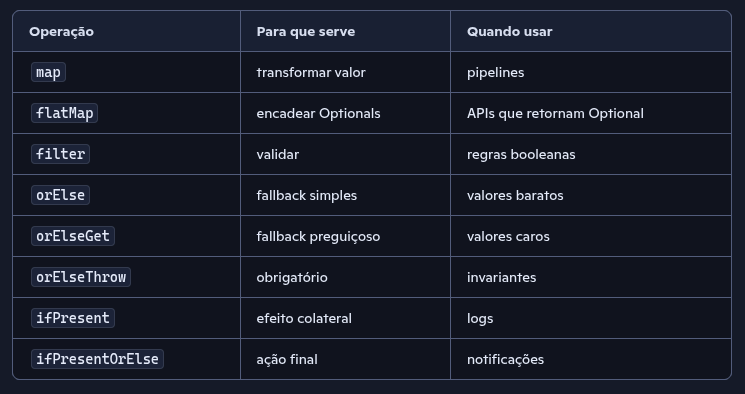

# AppOptional

## Como explicar Optional para outra pessoa

Optional não é para substituir null em todo lugar.
É para tornar explícito que um método pode não retornar valor.
Ele te força a lidar com isso de forma segura e fluente.

### Antes

```java
String email = usuario != null ? usuario.getEmail() : null;
if (email != null && email.contains("@")) {
    enviar(email);
}
```

### Depois

```java
usuario.flatMap(Usuario::emailOpcional)
       .filter(e -> e.contains("@"))
       .ifPresent(this::enviar);

```

